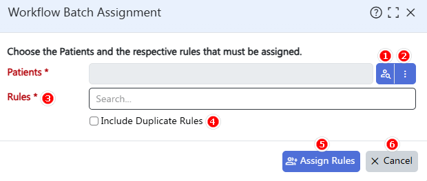

## Workflow Batch Assignment
### Overview
The Workflow Batch Assignment module allows you to manually apply active workflow rule(s) to one or multiple patients at once.  
This helps save time, maintain consistency across your workflow, reduce errors, and improve overall efficiency in managing patient tasks or follow-ups.

> **Tip:** Workflow assignments are not applied retroactively. Workflow tasks will not be triggered for existing or past records. Due dates for tasks are calculated from the assignment date onward.

### Getting Started
1. Use this module to manually apply workflow rule(s) to all patients or a subgroup at once.  
2. **Person Search Button:** Open Patient Lookup and select one or more patients.  
   > **Tip:** Use Advanced Search to narrow down your patient selection.  
3. **Three-dot Menu:** Manage the selected patient list:  
   - Add to list: Adds new patients to an existing list.  
   - Replace list: Replaces the current list with newly selected patients.  
   - Clear list: Removes all selected patients from the list.  
4. **Rules:** Select one or multiple workflow rules from the list of active workflows.  
5. **Include Duplicate Rules:**  
   - Unchecked: Workflow assigned only to new patients.  
   - Checked: Workflow also assigned to patients who already have it.  
6. **Assign Rules Button:** Click to assign workflow rule(s) to the selected patients.  
7. **Cancel Button:** Cancels the operation without saving or applying changes.

### FAQs

[Q] Can I assign multiple workflows in a single batch?  
[A] Yes, you can select and assign multiple workflows to the same group of patients in one batch operation.  

[Q] How are due dates calculated for batch assigned workflows?  
[A] Due dates are automatically determined based on the workflow’s predefined timeline/configuration.  

[Q] Can I undo or remove a batch assignment?  
[A] No. Once assigned, workflows cannot be undone as a batch. You can remove or cancel individual workflow assignments manually via:  
Global Search > Patient Task Dashboard.  

[Q] When should I use the Workflow Batch Assignment feature?  
[A] Use it to assign standardized workflows—like periodic assessments, care plans, or checklists—to multiple patients simultaneously.  
